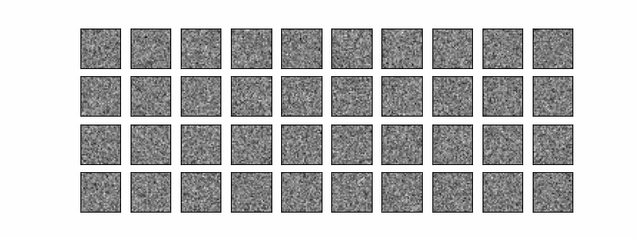
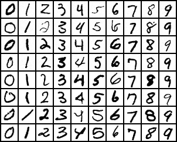

# Diffusion MNIST: From Noise to Digits

  

## Table of Contents

1. [Overview](#overview)
2. [Theoretical Background](#theoretical-background)
3. [Mathematical Formulation](#mathematical-formulation)
4. [Implementation](#implementation)
5. [Results](#results)
6. [FAQ](#faq)

## Overview

Diffusion models are a novel and promising approach in generative AI, particularly effective for image generation. The essence of diffusion models can be broken down as follows:

1. Begin with clear images (in our case, MNIST digits).
2. Gradually add noise until the images become completely unrecognizable.
3. Train a neural network to reverse this process, effectively learning to "denoise" the images.
4. Generate new images by starting with pure noise and progressively "denoising" it.

This process allows the model to learn the underlying structure of the data distribution step by step, creating new images that resemble the training data.

## Theoretical Background

Diffusion models consist of two main processes:

### 1. Forward Process (Diffusion)

The forward process gradually adds Gaussian noise to the data over a fixed number of steps. Starting from the original image, noise is added iteratively until we are left with pure noise. This process is designed to follow a simple distribution, typically Gaussian, as the noise becomes dominant.

### 2. Reverse Process (Denoising)

The reverse process is where the magic happens. A neural network is trained to reverse the forward process, step by step, by predicting and removing the noise added at each stage. By iteratively applying this reverse process, we can transform pure noise into a sample from the target distribution—MNIST digits, in our case.

### Training

Training involves minimizing the difference between the noise added during the forward process and the noise predicted by the neural network during the reverse process. This is typically done by optimizing a variant of the variational lower bound, ensuring that the model learns to denoise effectively.

### Sampling

Sampling starts with pure noise. The trained model is then applied iteratively to denoise the sample, gradually transforming it into an image from the target distribution. The result is a newly generated MNIST digit.

## Mathematical Formulation

Let's break down the key equations driving our diffusion model:

### 1. Forward Process:

The forward process adds noise to the data, defined as:

$$
q(x_t|x_{t-1}) = \mathcal{N}(x_t; \sqrt{1-\beta_t}x_{t-1}, \beta_t\mathbf{I})
$$

Here, $\beta_t$ is a variance schedule that controls the amount of noise added at each step.

### 2. Reverse Process:

The reverse process is modeled as:

$$
p_\theta(x_{t-1}|x_t) = \mathcal{N}(x_{t-1}; \mu_\theta(x_t, t), \Sigma_\theta(x_t, t))
$$

In this equation, $\mu_\theta$ and $\Sigma_\theta$ are the mean and variance predicted by our neural network, which learns to reverse the noise addition.

### 3. Training Objective:

The objective is to minimize the difference between the added noise and the noise predicted by the model. The loss function can be simplified as:

$$
\mathcal{L}_\text{simple} = \mathbb{E}_{t,x_0,\epsilon}[||\epsilon - \epsilon_\theta(x_t, t)||^2]
$$

Where $\epsilon_\theta(x_t, t)$ is the noise predicted by the model, and $\epsilon$ is the actual noise added.

### 4. Sampling:

To generate new samples, we start with pure noise and apply the reverse process:

$$
x_{t-1} = \frac{1}{\sqrt{\alpha_t}}(x_t - \frac{1-\alpha_t}{\sqrt{1-\bar{\alpha_t}}}\epsilon_\theta(x_t, t)) + \sigma_t z
$$

Here, $z \sim \mathcal{N}(0, \mathbf{I})$, and $\alpha_t = 1 - \beta_t$, with $\bar{\alpha_t} = \prod_{s=1}^t \alpha_s$.

To put it simply: We start with noise, and then we un-noise it bit by bit, until—voilà—we have a digit!

## Implementation

Here's a brief overview of the files in our project:

- **`ddpm.py`**: Contains the core implementation of the Denoising Diffusion Probabilistic Model (DDPM). This includes the forward and reverse processes, as well as the logic for training the model.

- **`diffusion_model.py`**: Defines the neural network architecture used for predicting noise in the reverse process. This is the backbone of the denoising step.

- **`diffusion_schedules.py`**: Manages the noise schedules, i.e., how noise is added during the forward process and how it's removed during sampling. The schedules control how gradually the image transitions from clear to noisy and back again.

- **`train.py`**: Handles the training loop. It sets up the dataset, initializes the model, and runs the training process, logging progress along the way.

## Results

  
   
  <em>Samples generated by our diffusion model</em>

*isn't that cute?*

## FAQ

### Q: How does this compare to GANs or VAEs?

A: Diffusion models offer more stable training compared to GANs and can produce higher quality samples than typical VAEs. However, they generally require more sampling steps, making the generation process slower.

### Q: Can this be applied to other types of data?

A: Yes, while this implementation focuses on MNIST digits, diffusion models have been successfully applied to various types of data, including high-resolution images and even audio.

---

_noise isn't that annoying (sometimes)_
